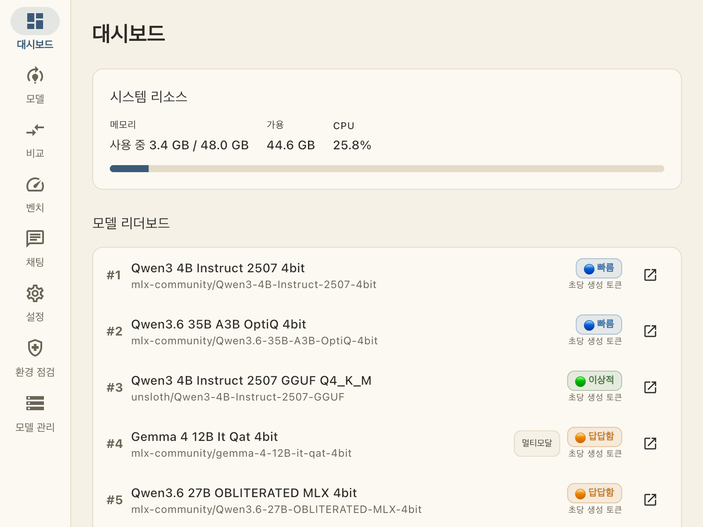
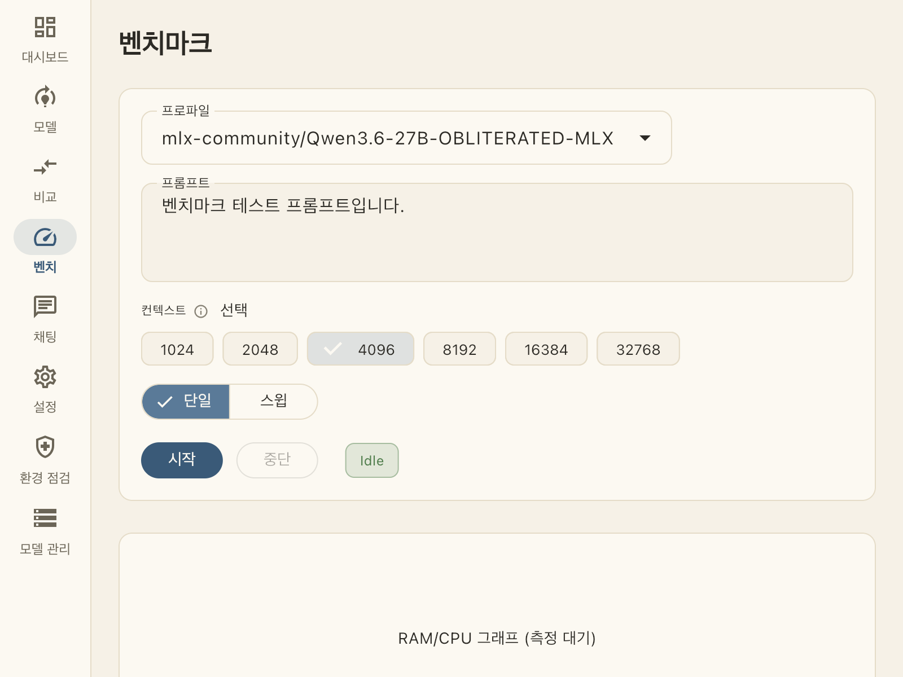
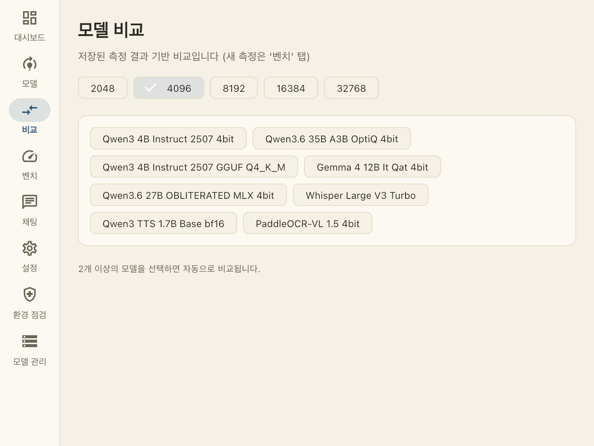
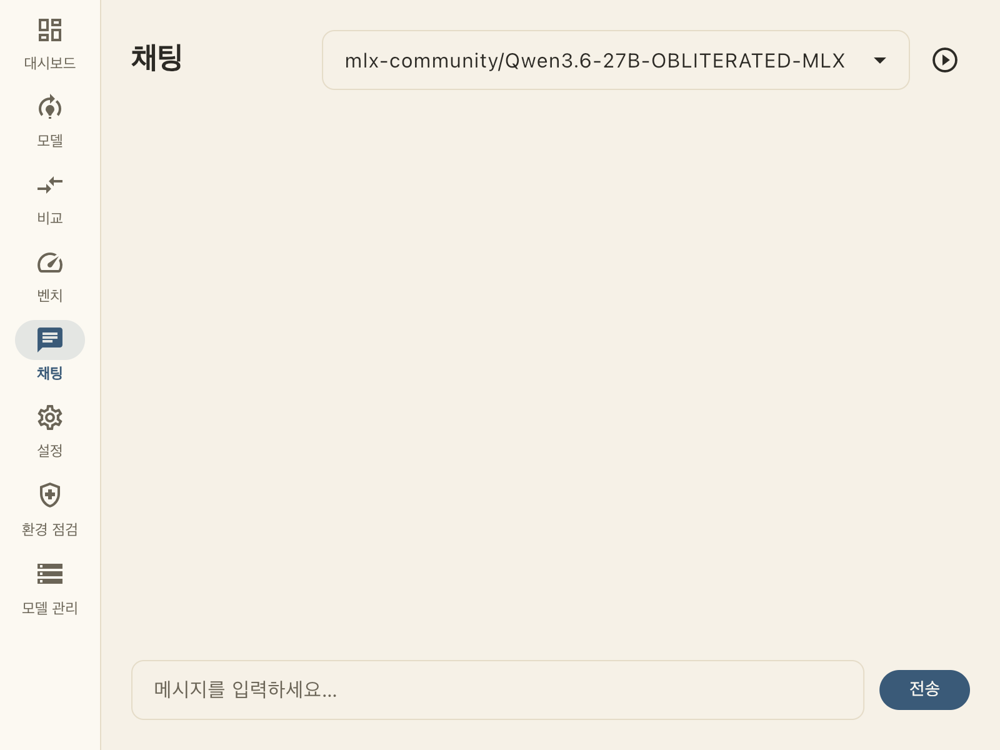
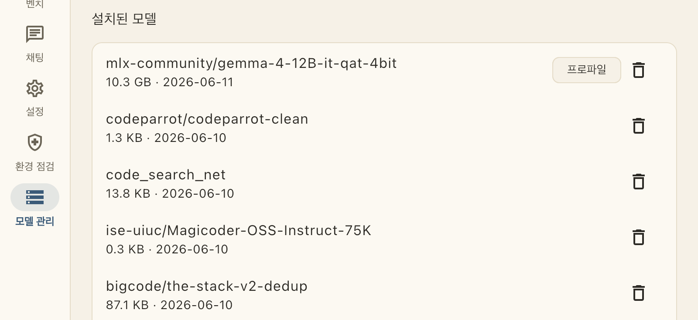

# AI Dashboard

**Apple Silicon Mac에서 로컬 AI 모델 성능을 실측·비교하는 데스크탑 앱**

"이 모델, 내 맥에서 돌아갈까? 얼마나 빠를까?" — 추정치가 아니라 **내 기기에서 직접 측정한 값**으로 답합니다. Hugging Face에서 모델을 검색·설치하고, 태스크별 벤치마크를 돌리고, 결과를 리더보드와 비교 화면에서 한눈에 봅니다.



## 어떤 앱인가

- macOS(Apple Silicon) 전용 네이티브 앱입니다. MLX 기반 로컬 추론으로 모델을 실제로 실행해 측정합니다.
- 모든 수치는 실측입니다 — TPS(초당 생성 토큰), TTFT(첫 토큰까지 시간), Peak RAM, CPU 사용률을 측정 중 실시간 샘플링합니다.
- 측정 중 메모리가 한도에 가까워지면 모델을 즉시 언로드해 시스템을 보호합니다.
- LLM뿐 아니라 태스크별로 다른 테스트 환경을 제공합니다:

| 태스크 | 벤치 입력 | 핵심 지표 |
|--------|-----------|-----------|
| 텍스트 생성 (LLM) | 프롬프트 + 컨텍스트 크기 | TPS · TTFT · Peak RAM |
| 멀티모달 (이미지+텍스트) | 프롬프트 + 이미지 | TPS · TTFT · Peak RAM |
| 음성→텍스트 (STT) | 오디오 파일 | 처리시간 · Peak RAM |
| 텍스트→음성 (TTS) | 합성 텍스트 | 처리시간 · Peak RAM |
| 이미지 생성 | 프롬프트 | 처리시간 · Peak RAM |

TPS가 뭔지 몰라도 됩니다 — 모든 지표 옆에 ⓘ 아이콘과 짧은 부연이 있고, 누르면 자세한 설명과 등급표가 나옵니다.

## 화면 소개

### 벤치마크 — 모델을 실측한다

프로파일을 고르고 컨텍스트 크기를 선택한 뒤 시작을 누르면, 측정 중 RAM/CPU 그래프가 실시간으로 그려집니다. 단일 측정과 컨텍스트 스윕(여러 크기 연속 측정)을 지원합니다. 모델 태스크에 따라 입력 UI가 자동으로 바뀝니다(STT면 오디오 선택, 멀티모달이면 이미지 첨부).



### 비교 — 저장된 측정으로 모델끼리 맞붙인다

게임 캐릭터 스펙 비교하듯, 측정해둔 모델 2개 이상을 골라 지표별로 나란히 봅니다. 서로 다른 태스크의 모델을 섞으면 "직접 비교는 참고용"이라고 알려줍니다.



### 채팅 — 측정한 모델과 직접 대화해본다

수치만으로 부족할 때, 같은 모델을 채팅으로 체감해봅니다. 멀티모달 모델이면 이미지 첨부 버튼이 생기고, 채팅이 불가능한 모델(STT 등)을 고르면 벤치 탭으로 안내합니다.



### 모델 관리 — 검색·설치·삭제를 앱 안에서

Hugging Face 모델을 한국어 태스크 라벨과 함께 검색하고, 클릭 한 번으로 설치/삭제합니다. 디스크·캐시 사용량도 함께 보여줍니다. 캐시는 Hugging Face 표준 위치(`~/.cache/huggingface/hub`)를 그대로 쓰므로 다른 도구와 중복 다운로드가 없습니다.



## 설치

### 방법 1 — .dmg (배포받은 경우)

`AI_Dashboard-x.y.z.dmg`를 전달받았다면:

1. dmg를 열고 `app.app`을 Applications 폴더로 드래그합니다.
2. 처음 열 때 macOS가 차단하면: 시스템 설정 → 개인정보 보호 및 보안 → "확인 없이 열기" (서명만 된 비공증 앱입니다).
3. 모델 추론에는 Python 환경이 필요합니다 — [uv](https://docs.astral.sh/uv/)를 설치하세요 (`brew install uv`). 앱의 **환경 점검** 탭이 부족한 것을 알려줍니다.

.dmg는 소스에서 직접 만들 수도 있습니다 (아래 `scripts/package_dmg.sh`).

### 방법 2 — 소스 빌드

요구사항: Apple Silicon Mac, [Flutter](https://flutter.dev) 3.38+, [Rust](https://rustup.rs), [uv](https://docs.astral.sh/uv/)

```bash
git clone https://github.com/algocean1204/mlx-benchmark-dashboard.git
cd mlx-benchmark-dashboard

# Rust 코어 빌드
cd core && cargo build --release && cd ..

# Python 추론 환경
cd python && uv sync && cd ..

# 앱 실행
cd app && flutter run -d macos --release
```

.dmg를 직접 만들려면:

```bash
bash scripts/package_dmg.sh   # → dist/AI_Dashboard-<버전>.dmg
```

## 사용 흐름

1. **환경 점검** 탭에서 Python 환경·백엔드 준비 상태를 확인합니다.
2. **모델 관리** 탭에서 모델을 검색해 설치합니다 (예: `mlx-community/Qwen3-4B-Instruct-2507-4bit`).
3. 설치된 모델의 **프로파일**을 생성합니다 — 모델 config를 읽어 태스크·백엔드·컨텍스트 범위를 자동 추론합니다. 잘못 추론되면 모델 상세에서 태스크를 직접 바꿀 수 있습니다.
4. **벤치** 탭에서 측정합니다. 결과는 자동 저장됩니다.
5. **대시보드** 리더보드와 **비교** 탭에서 측정 결과를 봅니다.

### Hugging Face 토큰 (선택)

게이트 모델 접근이 필요하면 **설정** 탭에서 토큰을 등록합니다. 토큰은 macOS Keychain에 저장되고 화면에는 항상 마스킹(`hf_****xxxx`)되어 표시됩니다. 파일이나 로그에 평문으로 남지 않습니다.

## 아키텍처

```
Flutter (macOS UI)
   ↕ flutter_rust_bridge
Rust 코어 (측정 오케스트레이션 · 리소스 모니터링 · SQLite 기록 · CLI)
   ↕ localhost HTTP
Python 어댑터 (mlx-lm · mlx-vlm · mlx-whisper · mlx-audio · mflux · llama.cpp)
```

- 측정 데이터는 `~/Library/Application Support/AI_Dashboard/aidash.db`(SQLite)에 저장됩니다.
- 같은 코어를 쓰는 CLI(`aidash`)도 함께 빌드됩니다 — `aidash bench run`, `aidash profile generate`, `aidash stats overview` 등.

## 동작 환경

- macOS (Apple Silicon 전용 — MLX 기반)
- 메모리는 모델 크기에 따라: 4B 4bit ≈ 3GB, 12B 4bit ≈ 14GB, 27B 4bit ≈ 20GB (실측 Peak 기준)

## 라이선스

[Apache License 2.0](LICENSE)
