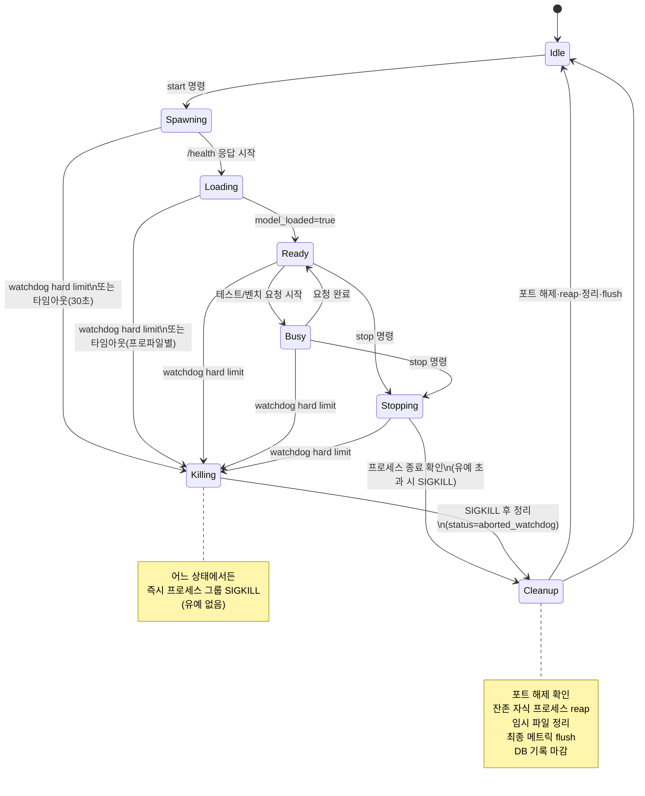

# AI_Dashboard 상세 기술 스펙

## 문서 정보

| 항목 | 내용 |
|---|---|
| 작성일 | 2026-06-10 |
| 상태 | 확정 (설계: Claude Fable 5 / 문서 작성: Grok Composer 2.5) |
| 상위 문서 | `service-design-decisions.md` |

---

## 1. 전체 아키텍처 개요

3층 구조:

```
[Flutter macOS UI]  ←flutter_rust_bridge(FFI, 스트림 포함)→  [Rust 코어 (lib)]
                                                                  │
                                              HTTP (127.0.0.1, 동적 포트)
                                                                  ↓
                                                  [Python 백엔드 서버 subprocess]
                                                  (OpenAI 호환 API + /metrics + /health)
```

### 핵심 원칙

- Rust 코어는 라이브러리(`aidash-core`)이며, 1단계에서는 CLI(`aidash-cli`)가, 2단계에서는 Flutter가 flutter_rust_bridge로 동일 lib API를 호출한다. CLI와 UI는 같은 코어를 공유하므로 기능 동등성이 보장된다.
- Rust → Python 통신은 localhost HTTP만 사용한다 (OpenAI 호환 엔드포인트 + 보조 엔드포인트). Python은 항상 자식 subprocess로 스폰되고, Rust가 프로세스 그룹 단위로 생사여탈권을 가진다.
- 이벤트(측정 샘플, 상태 전이, 로그)는 Rust 코어 내부 브로드캐스트 채널(tokio broadcast)로 흐르고, CLI는 stdout으로, Flutter는 FRB 스트림으로 구독한다.
- axum은 내부 보조용으로만 쓴다: (a) 라이브 모니터링용 로컬 WebSocket/SSE 디버그 서버(옵션), (b) 결과 카드 HTML 내보내기 미리보기 서버. v1 코어 경로의 필수 요소는 아니다.

---

## 2. Rust 워크스페이스 모듈 구조

Cargo workspace, 크레이트 2개:

| 크레이트 | 종류 | 역할 |
|---|---|---|
| `aidash-core` | lib | 전체 도메인 로직 |
| `aidash-cli` | bin | 1단계 CLI (clap 사용), aidash-core의 얇은 셸 |

### `aidash-core` 내부 모듈

| 모듈 | 책임 | IN | OUT |
|---|---|---|---|
| `profile` | 모델 프로파일 JSON 로드·검증·HF config.json 파싱으로 초안 생성 | 프로파일 파일 경로, HF repo id, 로컬 모델 경로 | `ModelProfile` 구조체, 검증 오류 |
| `pyproc` | Python subprocess 스폰·프로세스 그룹 관리·SIGTERM/SIGKILL·stdout/stderr 캡처 | 백엔드 종류, 프로파일, 컨텍스트 크기, 포트 | `ChildHandle`(pid, pgid, port), 프로세스 이벤트 |
| `lifecycle` | 상태 머신 (3절). 모든 상태 전이의 단일 소유자 | 명령(start/stop/abort), pyproc·watchdog 이벤트 | 상태 전이 이벤트, 현재 상태 조회 |
| `monitor` | 100ms 주기 리소스 샘플링: 프로세스 트리 phys_footprint(libproc `proc_pid_rusage`), CPU%(sysinfo), MLX 메모리(Python `/metrics` 폴링), 옵션 powermetrics(전력·온도·스로틀링, 관리자 권한 없으면 해당 필드 None) | 대상 pid 트리, 폴링 주기 | `ResourceSample` 스트림 |
| `watchdog` | 메모리 한계 감시·즉시 강제 종료 | `ResourceSample` 스트림, 한계 설정(soft/hard) | watchdog 이벤트(Warn/Kill), lifecycle에 Abort 명령 |
| `client` | Python 서버 HTTP 클라이언트 (reqwest): OpenAI 호환 호출 + 스트리밍 토큰 타임스탬프 기록, /health, /metrics | 요청(채팅/이미지/오디오), 서버 포트 | 스트리밍 토큰 이벤트, 완료 응답, 토큰별 타임스탬프 |
| `bench` | 측정 오케스트레이션: 단일 런, 컨텍스트 스윕, 한계 찾기(이진탐색), A/B 대결, 양자화 비교, 품질 미니평가 | 벤치 설정, 프로파일 | `RunResult`, 진행 이벤트 |
| `db` | rusqlite. 스키마 생성·마이그레이션·기록·조회·내보내기 | 결과·샘플·런 메타 | 쿼리 결과, JSON/CSV export |
| `export` | 결과 카드 이미지/HTML 생성 | run id 목록 | HTML 파일, 이미지 파일 |
| `events` | tokio broadcast 기반 통합 이벤트 버스 타입 정의 | — | `CoreEvent` enum (StateChanged, Sample, Token, WatchdogWarn, WatchdogKill, RunFinished, Log) |
| `api`(옵션) | axum 디버그 SSE/WebSocket + HTML 미리보기 | 이벤트 버스 | 로컬 HTTP |
| `env_detect` | 환경 감지: 시스템·도구·백엔드 패키지·HF 캐시 모델·토큰 소스 스캔, 항목별 상태와 해결 액션 산출 | — | `DoctorReport` (항목별 status: ok/warn/missing + fix_action) |
| `auth` | HF 토큰 관리: macOS Keychain 저장·조회·삭제, 외부 소스(hf-cli 토큰 파일, 환경변수) 감지·가져오기, whoami 검증 | 토큰 문자열(메모리 내에서만), import 명령 | 마스킹된 상태 정보, Keychain 항목 |

### 의존 크레이트

`tokio`, `sysinfo`, `rusqlite`, `axum`, `reqwest`, `clap`, `serde`/`serde_json`, `libproc`(phys_footprint), `nix`(시그널·프로세스 그룹), `keyring`(macOS Keychain).

---

## 3. 라이프사이클 상태 머신 (요구 9항 + 와치독 강제 전이)

상태: `Idle`, `Spawning`, `Loading`, `Ready`, `Busy`, `Stopping`, `Killing`, `Cleanup`

### 정상 흐름

| 전이 | 조건 |
|---|---|
| `Idle → Spawning` | start 명령. pyproc이 uv 환경에서 백엔드 서버 스폰 (새 프로세스 그룹). |
| `Spawning → Loading` | 프로세스 기동 확인(/health 응답 시작, 200 아님 허용). |
| `Loading → Ready` | /health가 model_loaded=true 반환. |
| `Ready → Busy` | 테스트/벤치 요청 시작. |
| `Busy → Ready` | 요청 완료. |
| `Ready\|Busy → Stopping` | stop 명령. 진행 중 요청 취소 → SIGTERM → 3초 유예. |
| `Stopping → Cleanup` | 프로세스 종료 확인. 유예 초과 시 SIGKILL 후 진입. |
| `Cleanup → Idle` | 포트 해제 확인, 잔존 자식 프로세스 reap, 임시 파일 정리, 최종 메트릭 flush, DB 기록 마감. |

### 강제 전이 (와치독, 어느 상태에서든)

| 전이 | 조건 |
|---|---|
| `* → Killing` | watchdog hard limit 도달. **즉시 프로세스 그룹 전체 SIGKILL** (유예 없음 — 급정지 허용 확정). |
| `Killing → Cleanup → Idle` | 위와 동일한 정리. 해당 런은 status=`aborted_watchdog`로 기록하고 마지막 측정 샘플까지 보존한다. |

### 타임아웃 가드

- `Spawning`: 30초
- `Loading`: 프로파일별 설정(기본 600초, 대형 모델 고려)
- `Stopping` 유예: 3초

초과 시 SIGKILL 경로로 강제 진행한다. 실패 시 상태는 항상 `Cleanup`을 거쳐 `Idle`로 수렴한다 — 어떤 경로로도 고아 프로세스를 남기지 않는 것이 불변식이다.

### 상태 다이어그램



---

## 4. 자원 감시·와치독 명세 (요구 8항, P3)

### 샘플링

- 샘플링 주기: 100ms (감시)
- DB 영속화: 500ms 다운샘플

### 측정값 (전부 실측, 추정 금지 — P2)

| 지표 | 정의 |
|---|---|
| `phys_footprint` | Python subprocess **트리 합** (libproc `proc_pid_rusage`의 ri_phys_footprint). macOS 메모리 압박 기준과 동일 지표. |
| `mlx_active_bytes` | Python `/metrics`에서 MLX `get_active_memory()` 값 (Metal 할당 실측). |
| `cpu_pct` | 프로세스 트리 CPU 사용률 (sysinfo). |
| 시스템 전역 | 사용 가능 메모리, 메모리 압박 수준. |
| 옵션 (powermetrics) | 전력(W)·온도·스로틀링 — 관리자 권한 없으면 None, UI는 해당 칸만 비활성. |

### 한계 설정

- **hard limit** 기본값: 시스템 RAM의 85% (48GB 기준 40.8GB) 또는 사용자가 GB 단위로 직접 지정
- **soft limit**: hard의 90% 지점에서 Warn 이벤트

### hard limit 도달 시 동작

1. watchdog → lifecycle에 Abort
2. 프로세스 그룹 SIGKILL (100ms 이내 발사 목표)
3. 데이터는 마지막 샘플까지 DB 보존

### 모델별 메모리 거동

Qwen 하이브리드 캐싱 등 모델별 메모리 거동 차이는 예외 처리로 덮지 않는다(요구 12항) — 동일한 실측·감시·강제종료 경로 하나로 일관 대응한다.

---

## 5. Python 백엔드 어댑터 계약 (P4, P5)

디렉터리: `python/` (uv 프로젝트, python3.12). 어댑터 = 실행 가능한 서버 모듈 1개씩:

| 어댑터 | 패키지 | 모델 종류 | 주 엔드포인트 |
|---|---|---|---|
| `serve_vllm_mlx` | vllm-mlx 0.3.0 | LLM (메인) | `/v1/chat/completions` (stream) |
| `serve_mlx_lm` | mlx-lm | LLM (폴백) | `/v1/chat/completions` (stream) |
| `serve_mlx_vlm` | mlx-vlm | 멀티모달 | `/v1/chat/completions` (image content parts) |
| `serve_llama_cpp` | llama.cpp (llama-cpp-python) | CPU 모드 | `/v1/chat/completions` |
| `serve_transformers` | transformers | CPU 모드 | `/v1/chat/completions` |
| `serve_mflux` | mflux | 이미지 생성 | `/v1/images/generations` |
| `serve_mlx_whisper` | mlx-whisper | ASR | `/v1/audio/transcriptions` |
| `serve_mlx_audio` | mlx-audio | TTS | `/v1/audio/speech` |

### 공통 계약

모든 어댑터가 지켜야 하는 공통 계약:

1. **기동 인자**: `--model-path`, `--context-size`(해당 시), `--port`, `--profile-json`(프로파일 전체 전달).
2. **`GET /health`** → `{status, model_loaded: bool}`. 로딩 중에도 응답해야 한다.
3. **`GET /metrics`** → `{mlx_active_bytes, mlx_peak_bytes, mlx_cache_bytes}` (MLX 미사용 백엔드는 0).
4. **OpenAI 호환 응답 형식**. chat template은 서빙 측이 처리한다 (P5 정규화 원칙).
5. **SIGTERM** 수신 시 정상 종료(모델 해제 후 exit 0), **SIGKILL**은 언제 와도 안전해야 한다 (쓰기 중 상태를 갖지 않는다 — 결과 기록은 전부 Rust 쪽 책임).
6. **stdout**에 구조화 로그(JSON lines) — Rust가 캡처해 이벤트 버스로 중계.

### 백엔드 확장

새 백엔드 추가 = 이 계약을 지키는 서버 모듈 1개 추가 + 프로파일의 backend 값 1개 추가. Rust 코드 수정 불필요 (P4·P6).

---

## 6. 모델 프로파일 JSON 스키마 (P5)

저장 위치: `profiles/*.json` (사용자 편집 가능).

### 스키마

```json
{
  "schema_version": 1,
  "id": "mlx-community/Qwen3-30B-A3B-4bit",
  "display_name": "Qwen3 30B A3B 4bit",
  "source": { "kind": "hf | local", "hf_repo": "...", "hf_file": "...", "local_path": "..." },
  "model_type": "llm | multimodal | image_gen | tts | asr",
  "backend": "vllm_mlx | mlx_lm | mlx_vlm | llama_cpp | transformers | mflux | mlx_whisper | mlx_audio",
  "io": { "input": ["chat", "image", "audio", "text"], "output": "text | image | audio" },
  "context": { "min": 512, "max": 131072, "default": 4096, "sweep_steps": [1024, 2048, 4096, 8192, 16384, 32768] },
  "default_params": { "max_tokens": 512, "temperature": 0.7, "top_p": 0.95 },
  "quantization": "4bit | 8bit | fp16 | null",
  "load_timeout_sec": 600,
  "notes": ""
}
```

### 운영 규칙

- **초안 자동 생성**: HF `config.json`을 파싱해 model_type, context.max, quantization 추정값을 채우고 사용자가 수정한다 (`aidash profile generate`).
- **검증**: 프로파일 검증 실패는 로드 시점에 명확한 오류로 표면화한다 (조용한 기본값 대체 금지).

---

## 7. SQLite 스키마 (요구 11항)

DB 파일: `~/Library/Application Support/AI_Dashboard/aidash.db`. WAL 모드.

```sql
CREATE TABLE models (
  id INTEGER PRIMARY KEY,
  profile_id TEXT NOT NULL UNIQUE,      -- 프로파일 JSON의 id
  display_name TEXT NOT NULL,
  model_type TEXT NOT NULL,
  backend TEXT NOT NULL,
  quantization TEXT,
  profile_json TEXT NOT NULL,           -- 실행 시점 프로파일 스냅샷
  created_at TEXT NOT NULL
);

CREATE TABLE runs (
  id INTEGER PRIMARY KEY,
  model_id INTEGER NOT NULL REFERENCES models(id) ON DELETE CASCADE,
  kind TEXT NOT NULL,                   -- single | sweep_step | limit_search | ab_battle | quant_compare | quality_eval | chat
  sweep_id INTEGER REFERENCES sweeps(id) ON DELETE SET NULL,
  context_size INTEGER,
  params_json TEXT NOT NULL,
  status TEXT NOT NULL,                 -- completed | aborted_watchdog | failed | cancelled
  started_at TEXT NOT NULL,
  ended_at TEXT
);

CREATE TABLE sweeps (
  id INTEGER PRIMARY KEY,
  kind TEXT NOT NULL,                   -- context_sweep | limit_search | ab_battle | quant_compare
  config_json TEXT NOT NULL,
  created_at TEXT NOT NULL
);

CREATE TABLE results (
  run_id INTEGER PRIMARY KEY REFERENCES runs(id) ON DELETE CASCADE,
  ttft_ms REAL,
  prefill_tps REAL,
  decode_tps REAL,
  total_tps REAL,
  tokens_in INTEGER,
  tokens_out INTEGER,
  peak_phys_footprint_bytes INTEGER,    -- 실측 피크
  peak_mlx_active_bytes INTEGER,
  avg_cpu_pct REAL,
  quality_score REAL                    -- 품질 미니평가 시
);

CREATE TABLE samples (
  id INTEGER PRIMARY KEY,
  run_id INTEGER NOT NULL REFERENCES runs(id) ON DELETE CASCADE,
  ts_ms INTEGER NOT NULL,               -- run 시작 기준 상대 ms
  phys_footprint_bytes INTEGER NOT NULL,
  mlx_active_bytes INTEGER,
  cpu_pct REAL,
  sys_available_bytes INTEGER,
  power_w REAL,                         -- powermetrics 가능 시
  temp_c REAL,
  throttled INTEGER                     -- 0/1, NULL=측정 불가
);
CREATE INDEX idx_samples_run ON samples(run_id, ts_ms);
```

차트 비교(요구 11항)는 models × results 조인으로 모델 간 TPS/RAM/CPU를 바로 그릴 수 있는 구조다.

---

## 8. 측정 방법론 (P2 — 실측 정의)

### 지표 정의

| 지표 | 정의 |
|---|---|
| TTFT | 요청 전송 시각 → 첫 토큰 수신 시각 (Rust client의 스트리밍 타임스탬프, 단조 시계) |
| prefill TPS | tokens_in ÷ (첫 토큰 수신 − 요청 전송) |
| decode TPS | (tokens_out − 1) ÷ (마지막 토큰 − 첫 토큰) |
| total TPS | tokens_out ÷ 전체 생성 시간 |
| RAM 피크 | run 구간 내 max(phys_footprint 트리 합), max(mlx_active) 각각 별도 기록 — 합산·추정하지 않고 두 실측값을 그대로 보존 |
| CPU | run 구간 평균·피크 |

### 벤치마크 모드

| 모드 | 설명 |
|---|---|
| ① 컨텍스트 스윕 | profile의 sweep_steps를 순회하며 각 단계마다 **서버 재시작 → 측정 → 종료** 풀 사이클 수행 (캐시 오염 방지). |
| ② 내 맥의 한계 찾기 | 컨텍스트 크기 이진탐색 — watchdog kill 발생 = 실패로 판정해 상한을 좁힌다. |
| ③ A/B 대결 | 메모리가 허용하면 동시 2서버, 아니면 순차 실행 후 나란히 표시. |
| ④ 양자화 비교 | 같은 모델의 변형 프로파일들로 순차 스윕. |
| ⑧ 품질 미니평가 | 내장 정답셋(소규모 JSON)으로 정확도 점수를 results.quality_score에 기록. |

---

## 9. CLI 커맨드 명세 (1단계 산출물 — 모든 기능 CLI 실행 가능)

```
aidash profile generate --hf <repo> | --local <path>   # HF config.json 파싱 → 프로파일 초안
aidash profile list
aidash profile validate <file>

aidash serve start --profile <id> --context <n> [--port <p>] [--mem-limit-gb <g>]
aidash serve stop
aidash status                                          # 상태 머신 현재 상태 + 라이브 리소스 1줄

aidash chat --profile <id> [--image <path>]            # 대화형 직접 테스트 (요구 3항)
aidash bench run --profile <id> --context <n> [--prompt-file <f>]
aidash bench sweep --profile <id> [--steps 1k,2k,4k,...]
aidash bench limit --profile <id>                      # 내 맥의 한계 찾기
aidash bench ab --a <id> --b <id> --prompt-file <f>
aidash bench quant --profiles <id1,id2,...>
aidash eval run --profile <id>                         # 품질 미니평가

aidash monitor                                         # 라이브 리소스 출력 (100ms)
aidash db list-runs [--model <id>]
aidash db export --run <id> --format json|csv
aidash db compare --models <id1,id2[,id3...]> [--context <n>] [--json]  # 모델 간 비교
aidash db delete --run <id> [--yes]                    # 런 1건 + 샘플·결과 삭제
aidash db delete --model <id> [--yes]                  # 모델 + 소속 런 전부 삭제
aidash stats overview [--context <n>] [--json]         # 전체 리더보드
aidash stats model <id> [--json]                       # 모델 상세 통계
aidash export card --runs <id1,id2> --out <dir>        # 결과 카드 HTML/이미지

aidash doctor [--json]                  # 환경 전체 감지 리포트 (항목별 ok/warn/missing + 해결 액션)
aidash auth status                      # 토큰 소스·마스킹 토큰·whoami 사용자명
aidash auth set                         # stdin 숨김 입력으로 토큰 등록 → Keychain
aidash auth import                      # 기존 hf-cli 토큰(~/.cache/huggingface/token) → Keychain 가져오기
aidash auth clear                       # Keychain에서 삭제
```

모든 커맨드는 종료 코드로 성공/실패를 구분하고 `--json` 플래그로 기계 판독 출력을 지원한다 (자동화 검증용).

---

## 10. 디렉터리 레이아웃 (목표)

```
AI_Dashboard/
├── core/                  # Rust workspace
│   ├── Cargo.toml
│   ├── aidash-core/
│   └── aidash-cli/
├── python/                # uv 프로젝트 (백엔드 어댑터들)
│   ├── pyproject.toml
│   └── adapters/serve_*.py
├── profiles/              # 모델 프로파일 JSON
├── app/                   # Flutter (2단계)
├── docs/
└── eval_sets/             # 품질 미니평가 정답셋
```

---

## 11. 2단계(Flutter) 연동 전제

- flutter_rust_bridge로 aidash-core lib API 직접 바인딩한다. 이벤트는 FRB Stream으로 구독한다 (상태 전이, 100ms 샘플, 토큰 스트림).
- 차트는 fl_chart를 사용한다. UI 상세 설계는 1단계 코어 검증 통과 후 별도 문서로 작성한다 (P6).

---

## 12. 1단계 완료 판정 기준 (검증 게이트)

1. `aidash serve start → chat → serve stop` 풀 사이클 후 고아 프로세스 0개, 포트 해제 확인.
2. 메모리 한계를 인위적으로 낮춰 (`--mem-limit-gb`) watchdog kill이 실제 발사되고, run이 aborted_watchdog로 기록되며, 시스템이 Idle로 복귀.
3. 실측 RAM이 Activity Monitor의 메모리(phys_footprint) 값과 일치 수준임을 수동 대조.
4. 컨텍스트 스윕 1회 완주 → DB에 단계별 결과 기록 → `db export` 정상.
5. 8개 어댑터 중 최소 vllm_mlx, mlx_lm, llama_cpp 3개로 실모델 측정 성공 (나머지는 후속 작업 단위).

---

## 13. 환경 감지 (doctor)

### 감지 항목과 판정

| 분류 | 항목 | 판정 |
|---|---|---|
| 시스템 | macOS 버전, Apple Silicon 여부, 총 RAM, 디스크 여유 | Apple Silicon 아님 = missing(vllm-mlx 모드 불가, CPU 모드만 안내), 디스크 < 20GB = warn |
| 도구 | uv 존재·버전, python3 ≥3.12 존재 | 없으면 missing + 설치 명령 제안 |
| 백엔드 | 프로젝트 venv(`python/.venv`) 내 8개 백엔드 패키지 설치 여부·버전 (uv extras 단위) | 미설치 = missing + `uv sync --extra <name>` 제안 |
| 외부 설치본 | pipx venvs, 알려진 venv 경로의 vllm-mlx 등 — **정보 표시용** (재사용하지 않음, 자체 venv가 기준) | 항상 info |
| 모델 | HF 캐시(`~/.cache/huggingface/hub`)의 `models--*` 스캔 → repo id·디스크 크기 목록, `profiles/`에 프로파일 존재 여부 매칭 | 프로파일 없는 캐시 모델 = "프로파일 생성 가능" 액션 제안 |
| 토큰 | (1) Keychain(앱 자체), (2) `~/.cache/huggingface/token`, (3) env `HF_TOKEN`/`HUGGING_FACE_HUB_TOKEN` — 존재 여부만 | 어디에도 없음 = warn (공개 모델만 가능 안내) |

### 원칙

- 감지 결과는 `DoctorReport` 구조체로 코어 API에 노출한다 — CLI `doctor`와 2단계 Flutter 설정 화면이 동일 데이터를 사용한다 (1코어 2프런트 원칙).
- 모든 missing/warn 항목은 반드시 구체적 fix_action 문자열을 동반한다 (예: "brew install uv", "uv sync --extra vllm").
- 토큰 값은 어떤 경로로도 로그·DB·리포트에 평문 노출하지 않는다 — 존재 여부와 마스킹(`hf_****...끝 4자`)만.

### 백엔드 의존성 전략 (5절 보완)

- `python/pyproject.toml`에 `[project.optional-dependencies]`로 백엔드별 extras를 정의한다: `vllm`(vllm-mlx==0.3.0), `mlx-lm`, `vlm`(mlx-vlm), `whisper`(mlx-whisper), `audio`(mlx-audio), `imagegen`(mflux), `cpu`(llama-cpp-python, transformers).
- 설치 단위 = extra. doctor가 extra별 상태를 감지하고, 미설치 백엔드로 serve 시도 시 시작 전에 명확한 오류 + 설치 명령을 안내한다 (어댑터 기동 후 ImportError로 죽는 것 금지).
- 외부에 이미 설치된 vllm-mlx(pipx 등)는 재사용하지 않는다 — 버전 통제·재현성을 위해 프로젝트 자체 venv만 사용한다. uv 전역 캐시 덕에 재다운로드는 발생하지 않는다.

---

## 14. 설정·토큰 관리와 UX 원칙

### HF 토큰 관리

- 저장소: **macOS Keychain만** (`keyring` 크레이트, 서비스명 `ai-dashboard`, 계정 `hf-token`). 평문 파일·DB·설정 JSON 저장 금지.
- 토큰 전달: pyproc이 자식 프로세스 환경변수 `HF_TOKEN`으로만 주입한다. **프로세스 인자로 전달 금지** (`ps`에 노출되기 때문).
- 검증: 등록·가져오기 시 HF `whoami-v2` API 호출로 유효성 확인 후 사용자명을 표시한다.
- 우선순위: Keychain > env > hf-cli 토큰 파일. (외부 소스는 읽기만 하고 수정하지 않는다.)

### 설정 UX 원칙 (2단계 Flutter 설정·온보딩 화면의 구속 규칙)

1. **감지 → 제안 → 원클릭**: 빈 입력 화면을 먼저 보여주지 않는다. 항상 doctor 자동 감지 결과를 먼저 표시하고, 사용자는 확인·수정만 한다.
2. 토큰 등록 화면: (a) 기존 소스(hf-cli/env) 감지 시 "기존 토큰 가져오기" 원클릭 버튼을 1순위로, (b) 붙여넣기 필드는 입력 즉시 whoami 검증 → 성공 시 사용자명·아바타 표시, 실패 시 이유 표시, (c) "토큰 없이 계속" 선택지 항상 제공 (공개 모델만 사용 가능 명시).
3. 상태 뱃지 3종으로 통일: ✅ 준비됨 / ⚠️ 조치 필요 / ⬇️ 설치 가능. 모든 ⚠️·⬇️ 항목 옆에는 해당 fix_action을 실행하는 "고치기" 버튼 1개 (터미널 명령을 사용자에게 시키지 않는다).
4. 백엔드 설치는 설정 화면 토글로: 토글 ON = `uv sync --extra <name>` 백그라운드 실행 + 진행률 표시. 실패 시 로그 전문을 펼쳐볼 수 있게.
5. 온보딩(첫 실행): doctor 1회 자동 실행 → 요약 카드(시스템 ✅/백엔드 상태/모델 n개 발견/토큰 상태) → 부족 항목만 단계로 안내. 전부 정상이면 1화면 만에 끝.

---

## 15. TPS 등급 체계와 통계·비교·삭제

### 15.1 TPS 등급 체계 (고정 공식)

decode TPS 기준 5등급. 근거: 성인 묵독 속도는 약 4~7 tokens/s — 10 TPS는 이를 간신히 넘는 수준이라 대화 흐름이 끊긴다.

| 등급 | 뱃지 | decode TPS | 의미 |
|---|---|---|---|
| 사용 불가 | 🔴 | < 10 | 묵독 속도를 간신히 넘는 수준 — 실사용 불가 |
| 답답함 | 🟠 | 10 이상 40 미만 | 사용 가능하나 긴 출력·코드에서 대기 체감 |
| 이상적 | 🟢 | 40 이상 60 미만 | 쾌적한 대화·코딩 보조 |
| 빠름 | 🔵 | 60 이상 100 미만 | 눈이 스트리밍을 못 따라가는 수준 |
| 실시간급 | 🟣 | 100 이상 | 사실상 즉답 |

적용 규칙: TPS가 표시되는 **모든 표면**(bench 결과 표, stats, list-runs, compare, 결과 카드 내보내기, Flutter 대시보드)에 등급 뱃지를 함께 표기한다. 등급 판정 함수는 `aidash-core`에 단일 구현(`tps_tier(decode_tps)`)으로 두고 전 표면이 공유한다.

### 15.2 모델 식별 규칙

- 프로파일 `id`는 **정확한 HF repo id** (`org/name` 형식, 정규식 `^[A-Za-z0-9_.-]+/[A-Za-z0-9_.-]+$`)여야 하며 프로파일 검증 시 강제한다.
- HF 링크는 `https://huggingface.co/{id}`로 자동 파생한다 — 별도 저장하지 않는다. `source.kind=local`인 모델은 링크 없음 + "(local)" 표기.
- 모든 출력 표면에서 모델은 repo id 그대로 표기하고 HF 링크를 동반한다 (CLI는 URL 텍스트, 결과 카드·대시보드는 하이퍼링크).

### 15.3 통계·분석 (stats)

- `db` 위에 집계 쿼리 계층 `stats`를 둔다 (별도 테이블 없음 — 항상 원본 runs/results에서 산출, 저장된 통계의 노후화 방지).
- 모델별 통계: 총 런 수, 최근 측정일, 컨텍스트 크기별 decode TPS min/avg/max, TTFT avg, peak phys_footprint / peak mlx_active, 현재 등급(최근 런 기준).
- 전체 리더보드: 모델 × 대표 decode TPS(동일 컨텍스트 기준 비교 — 기본 4096, 해당 컨텍스트 런이 없으면 가장 가까운 컨텍스트 사용 후 명시) 내림차순, 등급 뱃지·HF 링크 포함.
- CLI:
```
aidash stats overview [--context <n>] [--json]     # 리더보드
aidash stats model <id> [--json]                   # 모델 상세 통계
```

### 15.4 모델 간 비교 (번들 B 연계)

```
aidash db compare --models <id1,id2[,id3...]> [--context <n>] [--json]
```
- 동일(또는 최근접) 컨텍스트의 결과를 나란히 표로: decode TPS(+등급), TTFT, peak RAM, tokens_in/out, 측정일.
- 컨텍스트가 일치하지 않는 비교는 각 모델이 어떤 컨텍스트 값으로 비교됐는지 반드시 표기한다 (무언의 불공정 비교 금지).

### 15.5 영구 보존과 삭제

- 측정 결과는 SQLite에 영구 보존한다 — 자동 삭제·만료 없음. 삭제는 사용자 명시 행위로만.
- 스키마 보강: `runs → samples/results`에 `ON DELETE CASCADE`, `models → runs`에 CASCADE. (7절 SQL에 반영됨. 단, `runs.sweep_id`는 `ON DELETE SET NULL` — 스윕 삭제로 런이 사라지면 안 되므로.)
- CLI:
```
aidash db delete --run <id> [--yes]                # 런 1건 + 샘플·결과
aidash db delete --model <id> [--yes]              # 모델 + 소속 런 전부
```
- `--yes` 없으면 삭제 대상 요약(런 수·샘플 수)을 보여주고 확인 입력을 받는다.
- Flutter(2단계): 모든 런·모델 항목에서 스와이프/버튼으로 삭제 가능, 확인 다이얼로그 1회, 삭제 직후 실행취소(Undo) 스낵바 제공.

### 15.6 Flutter 대시보드 화면 요구 (2단계 구속 조건)

- 홈 대시보드: 모델 리더보드(등급 뱃지·HF 링크), 최근 측정 활동, 시스템 리소스 현황 카드.
- 모델 상세: 컨텍스트 크기별 TPS·RAM 차트(fl_chart), 통계 표, 소속 런 목록(삭제 가능), HF 링크 버튼.
- 비교 화면: 모델 2개 이상 선택 → 나란히 표 + 오버레이 차트. TPS 등급 구간을 차트 배경 밴드로 표시해 직관성 확보.
- 상세 UI 설계는 2단계 별도 문서에서 확정한다 (P6).

---

## 16. 다음 작업 단위 (이 문서 이후)

1. 리포 스캐폴드 생성 (core workspace + python uv + profiles + eval_sets)
2. lifecycle + pyproc + watchdog 구현 (가장 위험한 부분 선행)
3. serve_vllm_mlx 어댑터 + client 스트리밍 측정
4. bench(단일 런·스윕·한계) + db
5. 나머지 어댑터·export·api 순차 추가